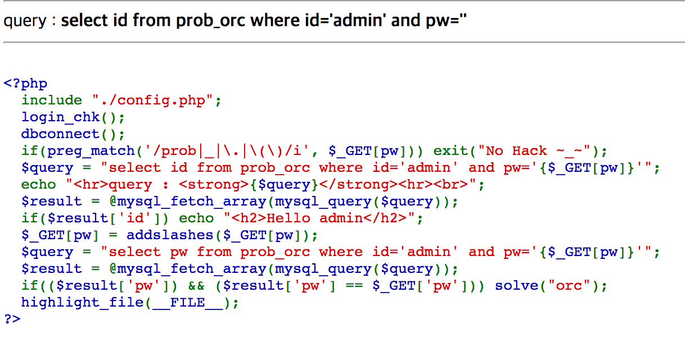
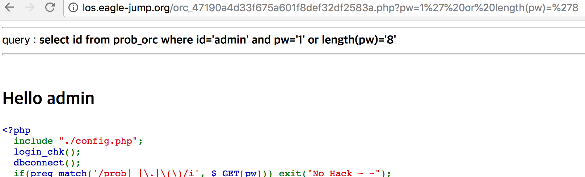
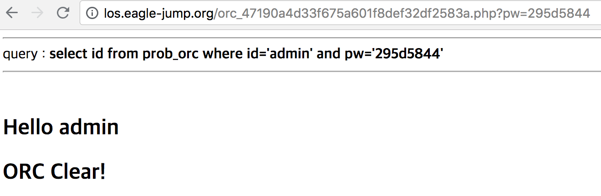

LOS Orc
=======

##

이번 문제는 직접 pw를 게싱해야 하는 blind SQL Injection 문제였다. 문제를 해결하기 위해서는 pw에 대한 정보가 필요했다. 그래서 아래 그림과 같이 pw의 정보를 알 수 있는 쿼리를 보내서 pw의 길이를 확인했다.

##

확인한 결과, pw의 길이는 8이었다. 길이가 8인 pw를 추측하려면 매우 많은 노가다를 필요로 했다. 이를 확인하려면 substr 함수를 이용해야 했고, substr(pw,1,1) = * 이런 식으로 문제를 해결했다.

위의 과정을 통해서 pw가 295d5844인 것을 알게 되었다.
####작성한 페이로드는 pw=295d2844이다.
