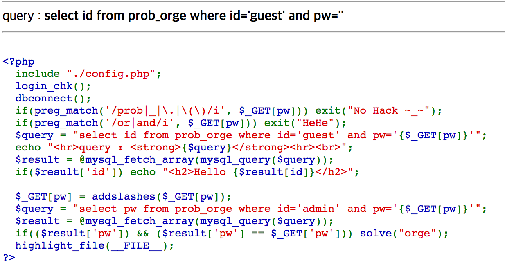
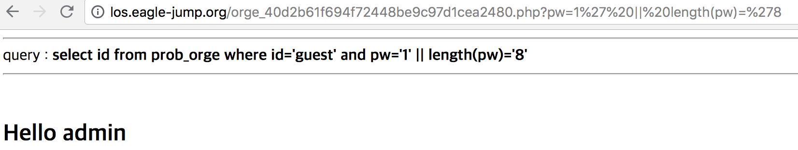
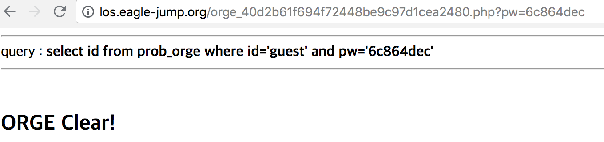

LOS Orge
========

##

이번 문제는 orc와 비슷한 문제이지만, or, and를 preg_match 함수를 통해서 거르기 때문에, 파이프라인을 사용하여 문제를 해결해야 한다.

##

orc와 같이 pw의 길이를 우선 구하려 했다. 그렇게 구한 pw의 길이는 8이다.

##

orc와 같이 substr(pw,1,1) 부터 substr(pw,8,1)까지 문제를 푼 결과, pw는 6c864dec였다.
####작성한 페이로드는 pw=6c864dec이다.
