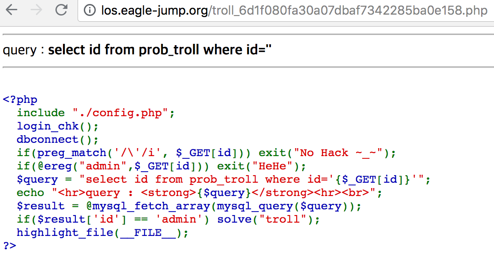
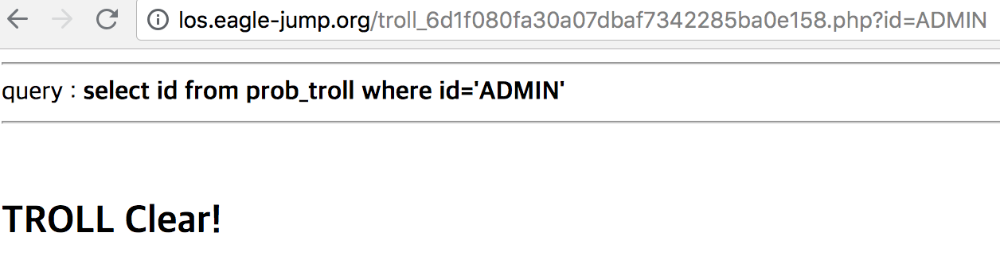

LOS Troll
===

***

***

이번 문제는 ereg를 통해서 admin이라는 문자열을 거르도록 하는 문제였다. 하지만 이 ereg 함수에는 취약점이 존재하는데, 이를 이용해서 문제를 해결할 수 있다.

***

ereg 함수는 대소문자를 구분하여 인식하기 때문에, ADMIN이라고 입력했을 경우, 문제를 쉽게 해결할 수 있었다.
현재 preg_match 함수를 이용하는 이유가 POSIX regex에서 PCRE regex로 추세가 움직이고 있고, POSIX에서 사용하는 것이 ereg이고, PCRE에서 사용하는 것이 preg_match이기 때문에, preg_match 함수를 이용하는 것이 옳다.

***

***

>**작성한 페이로드는 id=ADMIN이다.**
