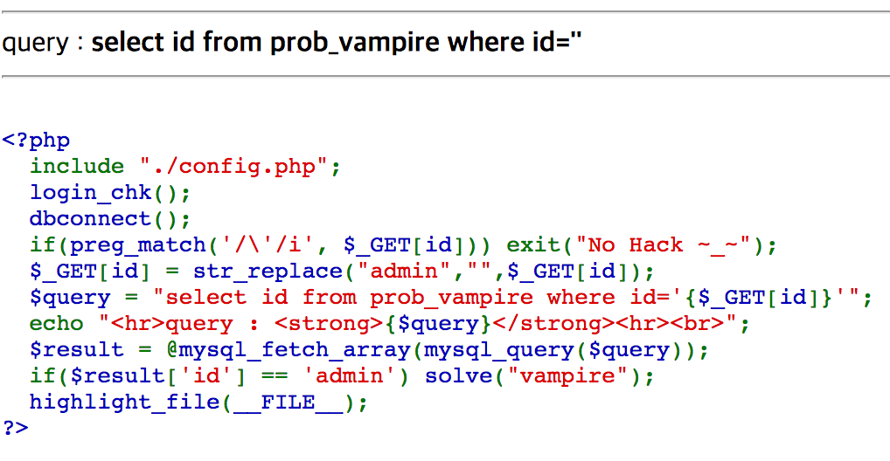
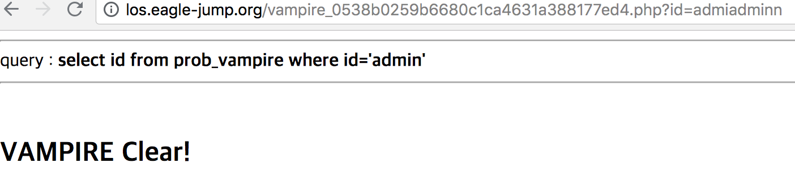

LOS Vampire
===

이번 문제는 id만을 입력하면 쉽게 문제를 풀 수 있지만, str_replace 함수를 통해서 admin이 확인되면, 그 문자열을 null 문자열로 치환한다. str_replace의 구조를 보면 첫 번째 문자부터 하나씩 탐색하면서 뒤의 문자열이 바꾸고자 하는 문자열일 경우 문자열을 치환하게 된다. 그래서 admin의 사이에 admin을 삽입하면 앞에 문자들은 넘기고, 중간의 admin 을 null로 바꾼 뒤, 뒤의 문자들을 다시 남겨놓게 된다. 그렇게 되면 id가 admin 이 되므로, 문제를 쉽게 해결할 수 있다.

####작성한 페이로드는 id=admiadminn이다.
