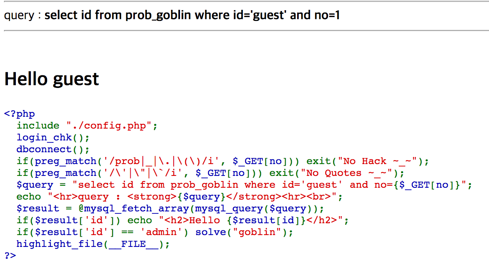
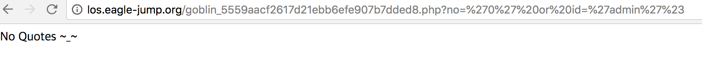
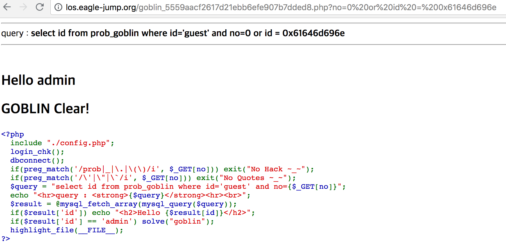

LOS Goblin
==========

##

문제를 처음 봤을때 확인한 것은 우리는 no를 입력해야 한다는 것이었다. 우선 no가 guest일 경우, 문제를 해결할 수 없었다. 그래서 guest의 index를 찾았다. index는 1이었다. 1 이외의 숫자를 입력해서 문제를 해결할 수 있었다.

##

위 그림에서 페이로드를 입력했을 때, no quotes라고 출력되었는데, 이는 ', " 등을 사용할 수 없다는 것을 의미하였다. 그래서 파라미터를 다른 방식으로 사용할 수 있는 방법을 찾았는데, 그 방법은 "id=0x61646d696e" 이런 식으로 사용하는 것이었다.

위에 서술한 방식대로 문제를 해결했다.
####작성한 페이로드는 ?no=0 or id=0x61646d696e이다.
